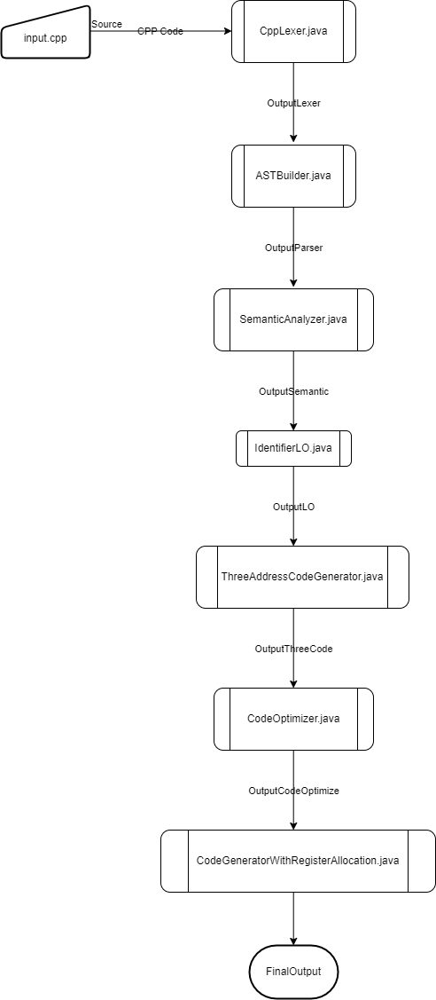

# Toy C++ Compiler in Java
This project is a toy version of a C++ compiler implemented in Java. It serves as a simplified demonstration of the compilation process and is not intended for production use.

## How it works

## Features
- Lexical analysis to tokenize C++ source code.
- Basic syntax analysis to build an Abstract Syntax Tree (AST).
- Simple semantic analysis for type checking.
- Intermediate code generation using a basic representation.
- Limited optimization techniques.
- Code generation

## Usage
1. Clone the repository.
2. Compile the Java source code.
3. Run the compiler with a C++ source file as input.

## Dependencies
- Java Development Kit (JDK)

## Limitations
- Supports a subset of C++ features.
- Limited error handling and reporting.
- Not optimized for performance.

## Contributing
Contributions are welcome. Feel free to fork the repository, make improvements, and submit pull requests.

## License
This project is licensed under the MIT License. See LICENSE file for details.

## Acknowledgements
- This project was inspired by the need to understand compiler basics.
